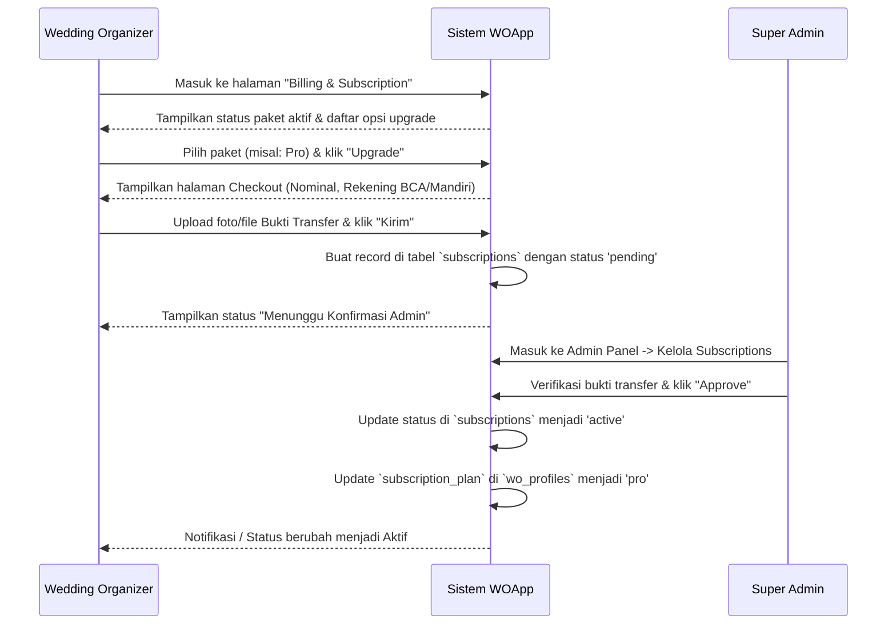

# 🎊 PRD — WOApp: Sistem Langganan & Checkout WO (Phase 2)

> **Dokumen Kebutuhan Produk (PRD) untuk Implementasi Sistem Subscription & Pembayaran untuk Wedding Organizer.**
> Versi: 1.0 | Tanggal: 3 Juli 2026 | Status: **Draft Proposal**

---

## 1. Latar Belakang & Masalah
Saat ini, skema paket langganan (`subscription_plan`) pada `wo_profiles` masih bersifat statis (di-set secara manual di database atau dipilih saat registrasi awal). Belum ada fitur bagi Wedding Organizer (WO) untuk:
1. Melihat status langganan aktif mereka.
2. Melakukan checkout/upgrade paket secara mandiri dari dalam dashboard.
3. Mengunggah bukti transfer pembayaran manual.
4. Pembatasan fitur aplikasi secara otomatis berdasarkan aturan paket (Feature Gate).

---

## 2. Aturan & Batasan Paket (Feature Gating)

Setiap paket langganan memiliki aturan dan limitasi akses sebagai berikut:

| Kriteria / Fitur | **Free** | **Basic** | **Pro** *(Recommended)* | **Enterprise** |
|---|---|---|---|---|
| **Harga Bulanan** | Rp 0 | Rp 199.000 | Rp 499.000 | Rp 999.000 |
| **Limit Project Aktif** | Maks. 1 Project | Maks. 5 Project | Tanpa Batas (Unlimited) | Tanpa Batas (Unlimited) |
| **Limit Anggota Tim** | Maks. 3 Anggota | Maks. 10 Anggota | Tanpa Batas (Unlimited) | Tanpa Batas (Unlimited) |
| **Landing Page Publik** | Tidak Aktif (Default) | Aktif (Ada label "Powered by WOApp") | Aktif Penuh (Bebas label) | Aktif Penuh + Dukungan Custom Domain |
| **Akses Akun Klien** | Tidak Aktif | Aktif | Aktif | Aktif |
| **Metode Pembayaran** | - | Transfer Manual | Transfer Manual | Transfer Manual |

---

## 3. Alur Kerja Langganan (Subscription Workflow)



---

## 4. Spesifikasi Halaman & Antarmuka (UI Specs)

### 4.1 Halaman Manajemen Langganan (Dashboard WO: `/wo/subscription`)
Halaman ini dapat diakses oleh WO melalui menu sidebar baru bernama **"Langganan & Billing"**.
- **Header**: Menampilkan nama paket aktif saat ini dan tanggal kedaluwarsa (jika ada).
- **Billing History Table**: Daftar riwayat langganan sebelumnya (Tanggal, Paket, Nominal, Status Pembayaran: *Pending / Active / Expired / Rejected*).
- **Pricing Cards Grid**: Opsi paket langganan (Free, Basic, Pro, Enterprise) dengan tombol "Pilih Paket" untuk melakukan upgrade/pembaharuan.

### 4.2 Halaman Checkout (`/wo/subscription/checkout/{plan}`)
Diakses setelah WO memilih salah satu paket berbayar.
- **Detail Invoice**: Ringkasan paket yang dipilih, harga, masa aktif (30 hari), dan total yang harus dibayar.
- **Instruksi Pembayaran**:
  - Bank tujuan transfer (contoh: Bank BCA, No. Rekening: `123-456-7890` a.n. `PT WOApp Digital Indonesia`).
  - Catatan instruksi untuk mentransfer nominal presisi (bisa ditambahkan 3 digit angka unik di belakang untuk mempermudah verifikasi).
- **Form Upload Bukti**:
  - Input file untuk mengunggah bukti transfer (JPG, PNG, PDF, maks. 2MB).
  - Tombol **"Kirim Bukti Pembayaran"**.

---

## 5. Implementasi Teknis (Technical Implementation Plan)

### 5.1 Route Baru (WO Panel)
```php
Route::middleware(['auth', 'role:wo'])->prefix('wo')->name('wo.')->group(function () {
    Route::get('subscription', [SubscriptionController::class, 'index'])->name('subscription.index');
    Route::get('subscription/checkout/{plan}', [SubscriptionController::class, 'checkout'])->name('subscription.checkout');
    Route::post('subscription/checkout/{plan}', [SubscriptionController::class, 'store'])->name('subscription.store');
});
```

### 5.2 Larangan / Pembatasan Fitur (Feature Gating)
Gunakan Laravel Middleware atau Laravel Gate/Policies untuk membatasi penambahan data:

#### Contoh Implementasi Gate pada Pembuatan Project Baru:
```php
Gate::define('create-project', function (User $user) {
    $profile = $user->woProfile;
    $plan = $profile->subscription_plan;
    $activeProjectsCount = $profile->projects()->where('status', 'active')->count();

    if ($plan === 'free' && $activeProjectsCount >= 1) {
        return false; // Limit paket Free terlampaui
    }
    if ($plan === 'basic' && $activeProjectsCount >= 5) {
        return false; // Limit paket Basic terlampaui
    }
    
    return true; // Pro & Enterprise unlimited
});
```
Jika limit tercapai, tampilkan pesan peringatan ramah: *"Batas proyek aktif untuk paket Free telah tercapai. Silakan upgrade ke paket Basic atau Pro untuk membuat proyek lebih banyak."*

---

## 6. Rencana Verifikasi & Testing
1. **Uji Coba Pengajuan Upgrade**: Mencoba alur pemilihan paket Pro dari dashboard WO, mengunggah bukti bayar, dan memastikan status langganan terekam sebagai `pending`.
2. **Persetujuan Admin**: Membuka Admin Panel, memverifikasi bukti bayar yang masuk, menyetujui (`approve`), dan memastikan paket WO berubah menjadi `pro`.
3. **Validasi Batasan (Gate Testing)**: Mendaftarkan akun WO baru (Free), mencoba menambahkan lebih dari 1 project, dan memastikan sistem menolak serta menampilkan instruksi upgrade.
